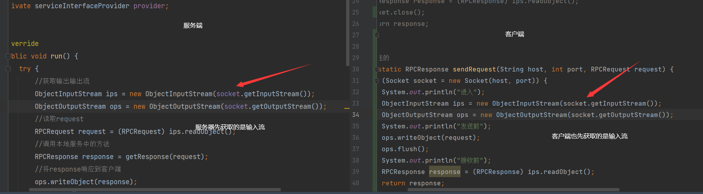

# 遇到的问题

# Question 1

> **在version2阶段，我自己尝试复刻的时候，因为写反了客户端socket获取输入和输出流的顺序，导致一直阻塞在input上**

最后发现的问题，其实并不在我把客户端socket的输入输出流写颠倒了，而是我同时把客户端和服务器的socket的输入输出流都写颠倒了，我把两个socket都设置为了先获取inputstream，再获取outputstream，这样导致的一个问题就是**请求连接上的一个死锁问题**



造成的原因：

在tcp/ip通信中，数据的通信是双向的，需要有响应的输入输出流才能建立正常的通信，如果只建立了输入流而没有建立输出流，就会导致服务器无法读取客户端消息，客户端也无法读取服务器消息，他们俩都互相等待对方的消息，造成死锁。在Socket编程中，我们首先获取输出流然后再获取输入流的原因在于，我们需要通过输出流向服务端发送请求，只有当这个请求被服务端接收后，服务端才会返回一个响应，这时我们才能通过获取到的输入流读取到服务端的响应。

具体来说，当我们在服务器端创建一个ServerSocket并监听某个端口时，它实际上就是在等待客户端的连接请求。而当客户端向服务器端发送连接请求时，服务器端的accept()方法就会返回一个新的Socket，这个新的Socket就是用来和客户端进行通信的。接着我们就可以在这个新的Socket上创建输入流和输出流了。其中，输出流用于将数据发送给客户端，输入流用于接收来自客户端的数据。所以，我们在获取输入流之前需要先获取输出流。

**我的理解**

> 我理解的意思是就像通信双发获取输入输出流阶段就像是tcp建立连接时一样，都需要一方先发送连接请求，才能完成后续的连接建立，但是因为我设置的两方都是先等对方发送连接请求，所以造成他们俩都一直在互相等对面发送连接请求

# Question 2

版本背景：version4

一个卡了三天的问题:绷不住了

问题描述 ：

优化序列化和反序列化方式时，写了两个用来序列化和反序列化的版本，一个java原生序列化，一个fastjson，问题就出在了fastjson上，

我业务中的其中一个方法的参数使用的类型是int类型，其他的为自定义对象。

```
User selectUserById(int id);
//原先的问题是这里的类型为int  导致使用json无法序列化 直接阻塞了
//原因 ：fastjson将int类型的数据序列化之后 再将其反序列化 会自动数据转换为Integer类型
//Blog selectBlog(int id);
Blog selectBlog(Integer id);
int insertUser(User user);
```

json序列化

```
@Override
public byte[] serializer(Object obj) {
    byte[] bytes = JSONObject.toJSONBytes(obj);
    return bytes;
}
```

json反序列化

```
@Override
public Object deserializer(byte[] bytes, int mesType) {
    Object obj = null;
    // 传输的消息分为request与response
    switch (mesType){
        case 0:
            //将字节数组转换为request请求
            RPCRequest request = JSON.parseObject(bytes, RPCRequest.class);
            // 修bug 参数为空 直接返回
            if(request.getParams() == null) return request;

            //打印参数转换前和转换后的变化
            //可以看到转换前的参数数组中存放的是json对象   {"sex":true,"id":100,"userName":"张三"}
            //转换之后 参数数组中存放的是java对象  User(id=100, userName=张三, sex=true)
            Object[] params = request.getParams();

            //存储request请求对象的参数信息
            Object[] objects = new Object[request.getParams().length];
            // 把json字串转化成对应的对象， fastjson可以读出基本数据类型，不用转化
            for(int i = 0; i < objects.length; i++){
                //获取参数对应的类型
                //判断该参数的类型是否和request中存储的参数类型匹配
                Object param = request.getParams()[i];
                Class<?> originalType = request.getParamsType()[i];
                if (!originalType.isAssignableFrom(param.getClass())){
                    //匹配 将参数转化为对应类型的参数 再将其存储进参数数组中
                    //阻塞在这里了
                    System.out.println("不一致  原参数类型为" + originalType + "  参数的类型为" + param.getClass());
                    objects[i] = JSON.toJavaObject((JSONObject)param ,originalType);

                    System.out.println("不一致  前" + request.getParams()[i] + " 后" + objects[i]);
                }else{
                    //不匹配 直接将参数放入数组中 不进行参数的转换
                    System.out.println("一致  原参数类型为" + originalType + "  参数的类型为" + param.getClass());
                    objects[i] = request.getParams()[i];
                    System.out.println("一致 " + originalType + "  " + request.getParams()[i].getClass());
                }

            }
            request.setParams(objects);

            //将转换之后的参数数组重新填回request中
            obj = request;
            break;
        case 1:
            //将字节数组转换为response响应
            RPCResponse response = JSON.parseObject(bytes, RPCResponse.class);
            Class<?> dataType = response.getDataType();
            //判断response中存储的data数据的数据类型是否和存储的数据类型一致
            if(! dataType.isAssignableFrom(response.getData().getClass())){
                //一致 类型转换后再重新赋值
                response.setData(JSONObject.toJavaObject((JSONObject) response.getData(),dataType));
            }
            obj = response;
            break;
        default:
            System.out.println("暂时不支持此种消息");
            throw new RuntimeException();
    }
    return obj;
}
```

先解释一下为什么在反序列时，已经反序列化成为request或response了，为什么还要对request或response中的参数进行二次反序列化？

**一个对象a，其中的属性包含的对象b，对a进行序列化之后生成的json数据，再对json数据进行反序列化，可以成功还原出对象a，但是对象a中的其他对象属性b还是json格式，所以要对其内部属性也进行反序列化**

其中，出问题的地方在于下面代码中：根据原参数类型，对request内部的属性进行反序列化时，直接阻塞在了

```
objects[i] = JSON.toJavaObject((JSONObject)param ,originalType);
```

根据前面打印的信息------------->>>>>>>不一致  原参数类型为int  参数的类型为class java.lang.Integer

可以看出：我本来进行序列化的参数类型为int，但是从这里反序列化之后的参数类型却是Integer，也就是说：**在进行序列化和反序列化过程中，fastjson自动将基本数据类型转换成了对应的包装类**，导致这里判断错误，强转失败。阻塞在这里

```
for(int i = 0; i < objects.length; i++){
    //获取参数对应的类型
    //判断该参数的类型是否和request中存储的参数类型匹配
    Object param = request.getParams()[i];
    Class<?> originalType = request.getParamsType()[i];
    if (!originalType.isAssignableFrom(param.getClass())){
        //匹配 将参数转化为对应类型的参数 再将其存储进参数数组中
        //阻塞在这里了
        System.out.println("不一致  原参数类型为" + originalType + "  参数的类型为" + param.getClass());
        objects[i] = JSON.toJavaObject((JSONObject)param ,originalType);

        System.out.println("不一致  前" + request.getParams()[i] + " 后" + objects[i]);
    }else{
        //不匹配 直接将参数放入数组中 不进行参数的转换
        System.out.println("一致  原参数类型为" + originalType + "  参数的类型为" + param.getClass());
        objects[i] = request.getParams()[i];
        System.out.println("一致 " + originalType + "  " + request.getParams()[i].getClass());
    }
}
```

总结：**fastjson在序列化和反序列化过程中，会自动将基本数据类型转换为对应的包装类。**

# Question 3

版本背景：version4

为什么使用fastjson序列化，**要序列化成JSONbyte数组**？而不直接序列化成json对象或json数组？

```java
byte[] bytes = JSONObject.toJSONBytes(obj);
```

要解决这个疑惑，我们要先了解，我们是基于netty实现的通信，而要在**netty中的缓冲区是ByteBuf**。

而写入ByteBuf缓冲区只有这么几种方法：

```java
byteBuf.writeBytes();//写入字节数组
byteBuf.writeInt();//写入int大小的数据
byteBuf.writeLong();//写入long大小的数据
byteBuf.writeShort();//写入short大小的数据
```

所以，最优解就是直接使用fastjson将java对象转换为json字节数组，**方便**直接写入缓冲区ByteBuf中

**主要还是正好有适配的方法,省事**，即：**使用byte数组写入缓冲区ByteBuf**<<<<<<----------->>>>>>**将java对象直接转换成jsonByte数组**


# Question4

使用fastjson进行序列化和反序列化时，序列化之后，再反序列化之后的数据对象，没有被成功赋值，全部都为null

**我在写user和blog对象时，忘了添加@Data注解，导致没有对应的set和get方法，fastjson无法获取响应的值，算是一个很简单的小问题，但是导致的结果很严重，以后要注意**

原因：

> 在进行fastjson序列化和反序列化时，被序列化和反序列化的参数确实需要具备get和set方法。这是因为在进行反序列化的过程中，fastjson依赖于这些方法来理解对象属性以及如何从JSON字符串中提取相应的值。